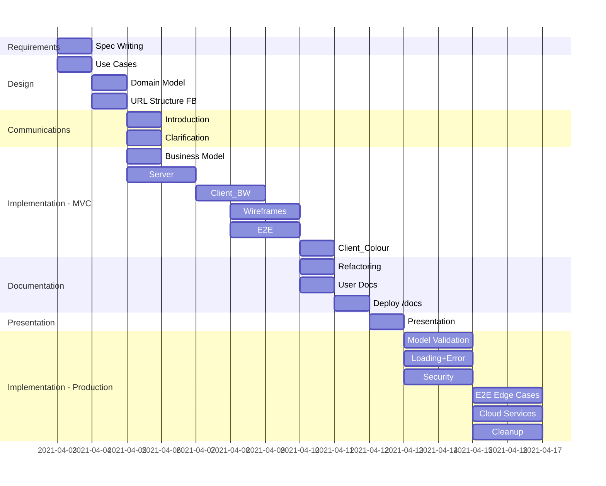
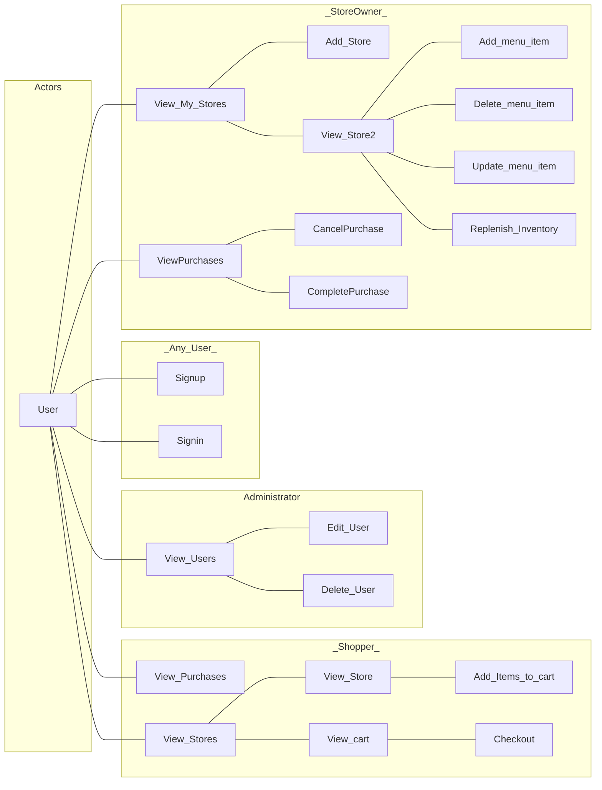
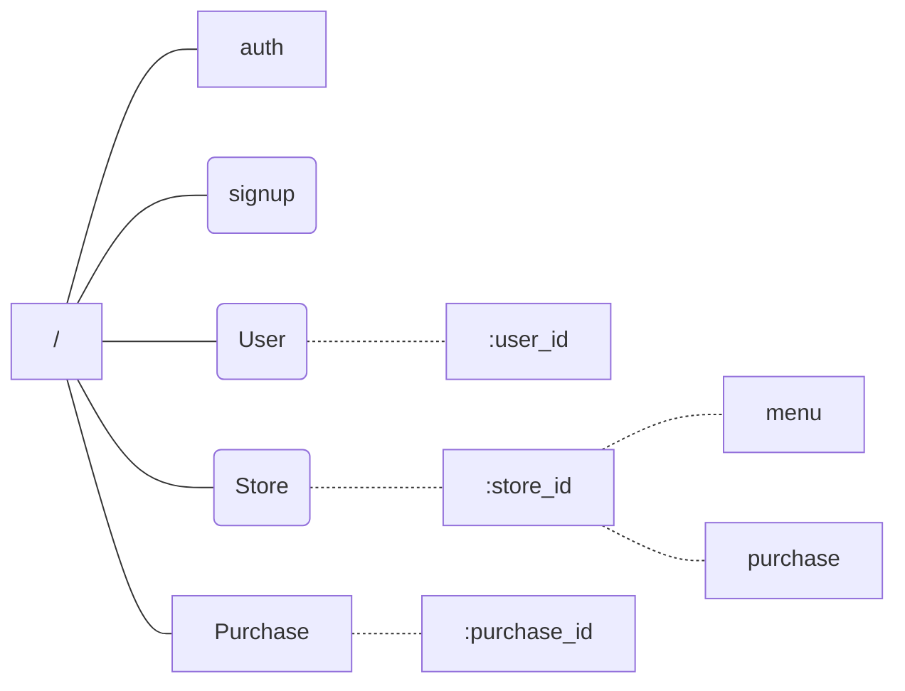
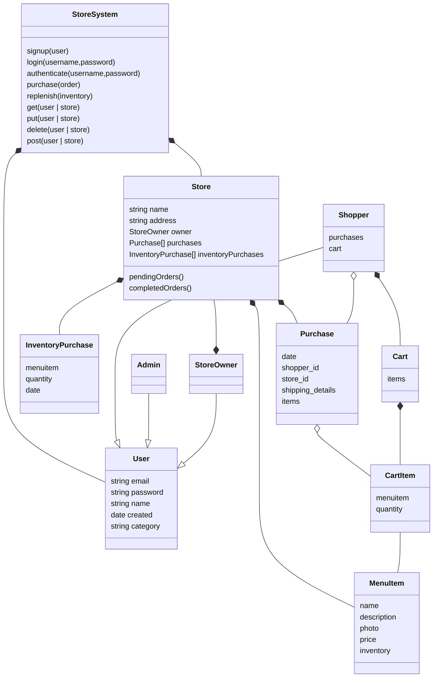
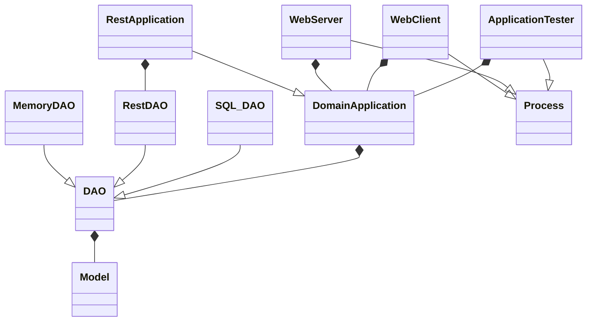
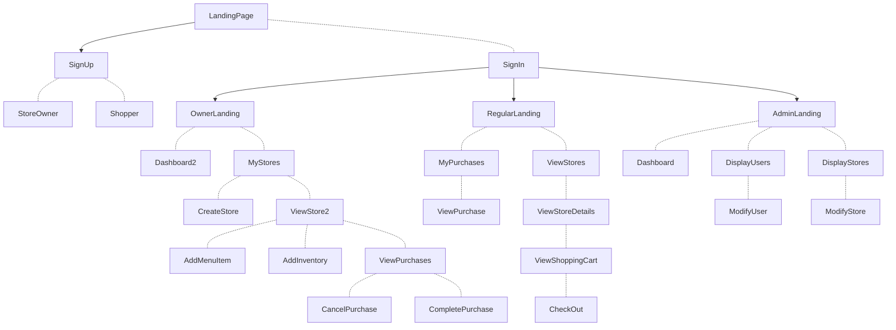
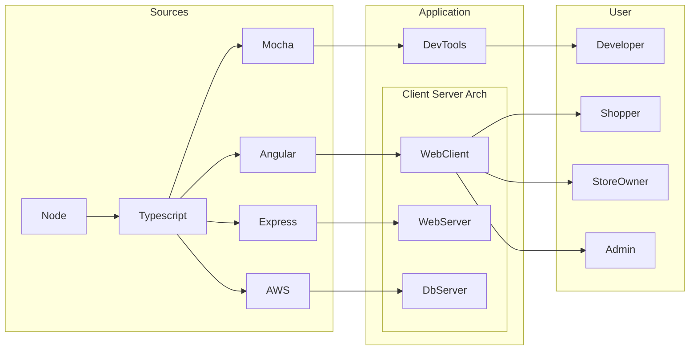
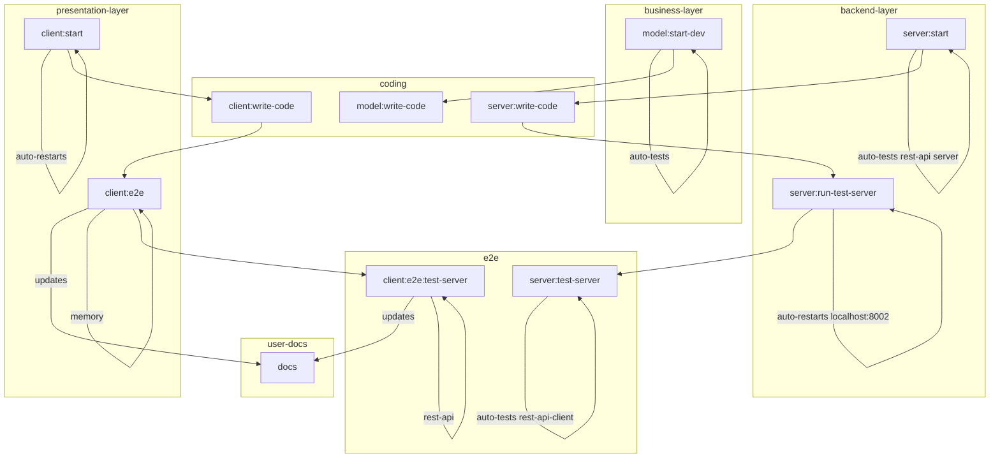

# Point of Sale System
- Alex Hawryschuk, 2021-05-07

# Introduction
This application serves to broker the exchange between buyer and seller. Sellers publish their store information and buyers peruse the stores, their menus, and purchase the inventory.

# TOC

# Functional Requirements
* Sign Up: First time visitors can sign up and immediately login
* Log In
- User role based access
    * Buyer:
        - View Stores
        - View Store Menu Items
        - View My Purchases
        - Create Purchase Order
    * StoreOwner:
        - Add Store
        - View My Stores
        - View Incoming Orders
        - Finish Incoming Order
        - Cancel Incoming Order
        - Replenish Inventory        
    * Admin:
        - View Users
- View Stores will be displayed:
    * sorted by distance
- Store Details will display:
    * distance
    * top selling product
    * least selling product
    * menu items ordered by most recently modified
- A Menu Item will display:
    * name
    * price
    * photo
    * description
    * number of units sold
    * number of units in inventory 

# Technical Requirements
- A REST API that can perform all of the features above
- The REST API will authenticate the user and authorize the access

# Development Plan

# Design
## Use Cases

## REST API

## Business Model

## Logical Design

## UI Design

### UI Components

## Physical Design

# DevOps

## Directory Structure
- business-model
- frontend-angular
- backend-server
    - backend-client
- abstract
    - common
    - dao
        - sqlite
        - cloud:*

## Development Processes

## Questions for Buyer
- Would you like to have graphic design work done? Do you have a logo or colour scheme?
- Where does the shopper and their purchases go when the user is deleted?

## Standard Features Added
- Model validations
- Security
- Further error handling in the UI
    - Present backend errors
    - Present backend delays
    - Present model invalidations

## Suggested Improvements
- Frontend
    - Email verification
    - Reset password
- Dev Process
    - Linting in the development processes
    - Semantic Release in the CI : Update the changelog automatically
- Backend
    - Choosing a hosting provider
        - IE: AWS w/ RDBMS|DynamoDB|S3
        - IE: Azure w/ CosmosDB
        - IE: Docker with Express/Mongo
        - IE: Server Host with Mysql
    - repository for npm packages
    - repository for build artifacts

## TODO
- Consult with buyer to negotiate further milestones and agile iterations

# Edge Case Tests
- admin cannot delete self account
- admin edit user with no name
- sign up with bad email
- sign up with no password
- non admins can not delete or edit users, stores, purchases
- create store with no name
- send an expired token
- server is down
- server responds slowly

# sections that go into a README
- The scope and functionality.
- Directory structure.
- Instructions to get it up and running.
- The solution approach, and a brief story about it.
- Difficulties you encountered and how you tackle them.
- Performance and space requirements of the solution.
- List of dependencies
- List of supported browsers/platforms.
- Next steps to improve the solution.
