# Point of Sale System
- Alex Hawryschuk, 2021-05-07

# Introduction
This application serves to broker the exchange between buyer and seller. Sellers publish their store information and buyers peruse the stores, their menus, and purchase the inventory.

# Table of Contents
- [Functional Requirements](#functional-requirements)
- [Technical Requirements](#technical-requirements)
- [Development Plan](#development-plan)
- [Design](#design)
	- [Use Cases](#use-cases)
	- [REST API](#rest-api)
	- [Business Model](#business-model)
	- [Logical Design](#logical-design)
	- [UI Design](#ui-design)
	- [Physical Design](#physical-design)
- [DevOps](#devops)
	- [Directory Structure](#directory-structure)
	- [Development Processes](#development-processes)
	- [Questions for Buyer](#questions-for-buyer)
	- [Standard Features Added](#standard-features-added)
	- [Suggested Improvements](#suggested-improvements)
	- [TODO](#todo)
- [Edge Case Tests](#edge-case-tests)
- [sections that go into a README](#sections-that-go-into-a-readme)
- [User Documentation](#user-documentation)
	- [Landing Page](#landing-page)
	- [Sign-Up](#sign-up)
	- [Sign Up as a Shopper](#sign-up-as-a-shopper)
	- [Log In as a Shopper](#log-in-as-a-shopper)
	- [View Stores](#view-stores)
	- [View Store Details](#view-store-details)
	- [Add A Store](#add-a-store)
	- [Add A New Menu Item](#add-a-new-menu-item)
	- [Delete a Menu Item](#delete-a-menu-item)
	- [Edit a Menu Item / Replenish product inventory](#edit-a-menu-item--replenish-product-inventory)
	- [View My Purchases](#view-my-purchases)
	- [Error Detection: Add Items to Cart](#error-detection-add-items-to-cart)
	- [Add Items to Cart](#add-items-to-cart)
	- [View My Cart](#view-my-cart)
	- [Purchase items in "My Cart" (Checkout)](#purchase-items-in-my-cart-checkout)
	- [Delete a User](#delete-a-user)
	- [Edit a User](#edit-a-user)
	- [Delete a Store](#delete-a-store)
	- [Edit a Store](#edit-a-store)
	- [Error Detection: Log In](#error-detection-log-in)
	- [Error Detection: Sign up](#error-detection-sign-up)
	- [Error Detection: Create a store](#error-detection-create-a-store)
	- [Error Detection: Delete a User](#error-detection-delete-a-user)
	- [Error Detection: Edit a User](#error-detection-edit-a-user)
	- [Error Detection: Edit Store](#error-detection-edit-store)

# Functional Requirements
* Sign Up: First time visitors can sign up and immediately login
* Log In
- User role based access
    * Buyer:
        - View Stores
        - View Store Menu Items
        - View My Purchases
        - Create Purchase Order
    * StoreOwner:
        - Add Store
        - View My Stores
        - View Incoming Orders
        - Finish Incoming Order
        - Cancel Incoming Order
        - Replenish Inventory        
    * Admin:
        - View Users
- View Stores will be displayed:
    * sorted by distance
- Store Details will display:
    * distance
    * top selling product
    * least selling product
    * menu items ordered by most recently modified
- A Menu Item will display:
    * name
    * price
    * photo
    * description
    * number of units sold
    * number of units in inventory 

# Technical Requirements
- A REST API that can perform all of the features above
- The REST API will authenticate the user and authorize the access

# Development Plan
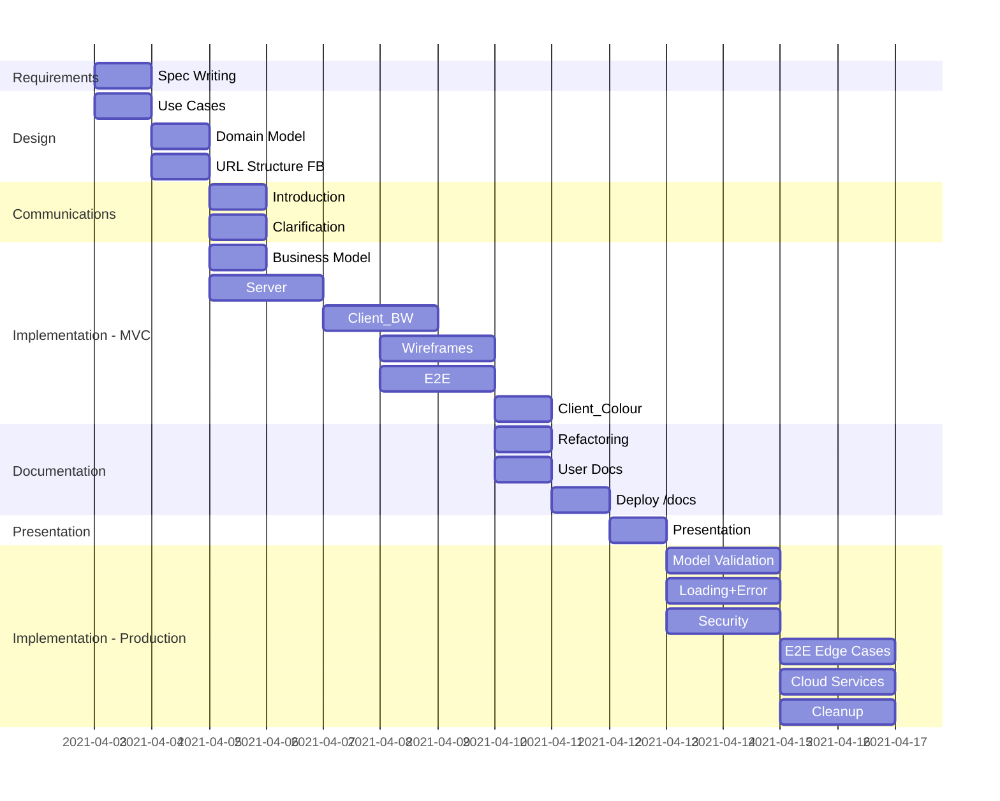
```mermaid
    gantt
        dateFormat YYYY-MM-DD

        section Requirements
            Spec Writing                    :2021-04-03, 1d
            
        section Design
            Use Cases                       :2021-04-03, 1d
            Domain Model                    :2021-04-04, 1d
            URL Structure FB                :2021-04-04, 1d

        section Communications
            Introduction                    :2021-04-05, 1d
            Clarification                   :2021-04-05, 1d
        
        section Implementation - MVC
            Business Model                  :2021-04-05, 1d
            Server                          :2021-04-05, 2d
            Client_BW                       :2021-04-07, 2d
            Wireframes                      :2021-04-08, 2d
            E2E                             :2021-04-08, 2d
            Client_Colour                   :2021-04-10, 1d

        section Documentation
            Refactoring                     :2021-04-10, 1d
            User Docs                       :2021-04-10, 1d
            Deploy /docs                    :2021-04-11, 1d

        section Presentation
            Presentation                    :2021-04-12, 1d

        section Implementation - Production
            Model Validation                :2021-04-13, 2d
            Loading+Error                   :2021-04-13, 2d
            Security                        :2021-04-13, 2d
            E2E Edge Cases                  :2021-04-15, 2d
            Cloud Services                  :2021-04-15, 2d
            Cleanup                         :2021-04-15, 2d

```

# Design
## Use Cases
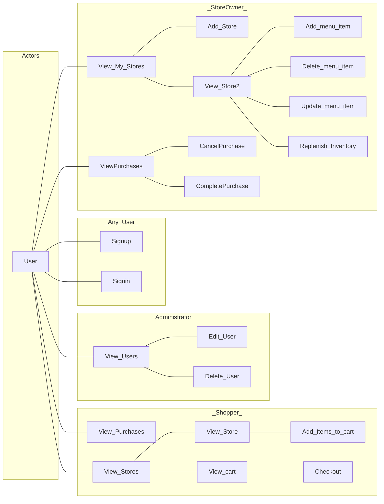
```mermaid
    graph LR
        subgraph Actors
            User
        end

        subgraph _Shopper_
            User --- View_Purchases & View_Stores
                View_Stores  --- View_cart & View_Store
                    View_Store --- Add_Items_to_cart
                    View_cart --- Checkout
        end

        subgraph Administrator
            User --- View_Users --- Edit_User & Delete_User
        end

        subgraph _Any_User_
            User --- Signup & Signin
        end
        

        subgraph _StoreOwner_
            User --- View_My_Stores --- Add_Store & View_Store2
                View_Store2 --- Add_menu_item & Delete_menu_item & Update_menu_item & Replenish_Inventory
            User --- ViewPurchases --- CancelPurchase & CompletePurchase
        end
        
```

## REST API
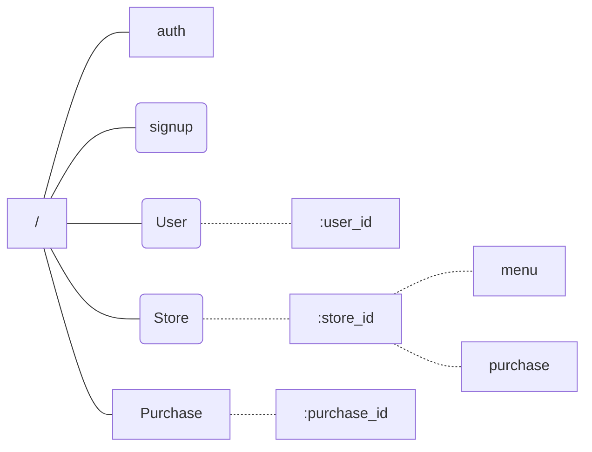
```mermaid
    graph LR
            / --- auth & API_signup(signup) & API_USER(User) & API_STORE(Store) & Purchase
                API_USER -.- :user_id
                API_STORE -.- :store_id -.- menu & purchase
                Purchase -.- :purchase_id

```

## Business Model
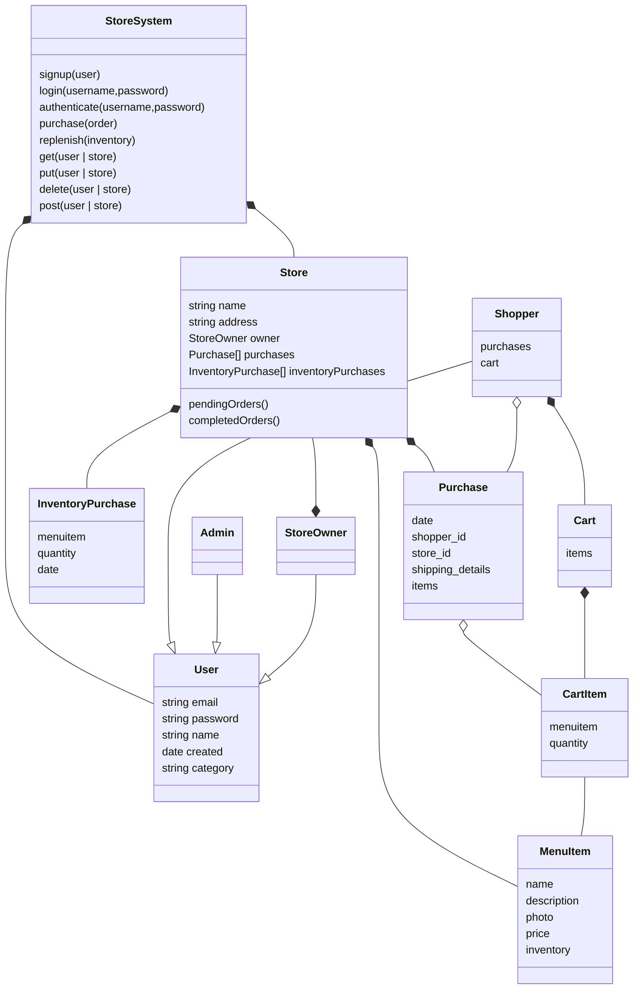
```mermaid
    classDiagram
        class StoreSystem {
            signup(user)
            login(username,password)
            authenticate(username,password)
            purchase(order)
            replenish(inventory)
            
            get(user | store)
            put(user | store)
            delete(user | store)
            post(user | store)
        }
        
        StoreSystem     *-- User
            StoreSystem *-- Store
        
        Purchase o-- CartItem

        class Purchase {
            date
            shopper_id
            store_id
            shipping_details
            items
        }

        class InventoryPurchase {
            menuitem
            quantity
            date
        }
        
        Shopper            --|> User
            Admin           --|> User
            StoreOwner    --|> User

        Store *-- MenuItem
        Store *-- InventoryPurchase
        Store *-- Purchase
        Shopper o-- Purchase

        Store --* StoreOwner

        class Cart { 
            items
        }

        class MenuItem {
            name
            description
            photo
            price
            inventory
        }

        class Shopper {
            purchases
            cart
        }

        Shopper *-- Cart
        Cart *-- CartItem
        CartItem -- MenuItem
        
        class CartItem {
            menuitem
            quantity
        }

        class User {
            string email
            string password
            string name
            date created
            string category 
        }

        class Admin {
        }
        
        class StoreOwner {

        }
        
        class Store {
            string name
            string address
            StoreOwner owner
            Purchase[] purchases
            InventoryPurchase[] inventoryPurchases
            pendingOrders()         
            completedOrders()
        }
        
```

## Logical Design
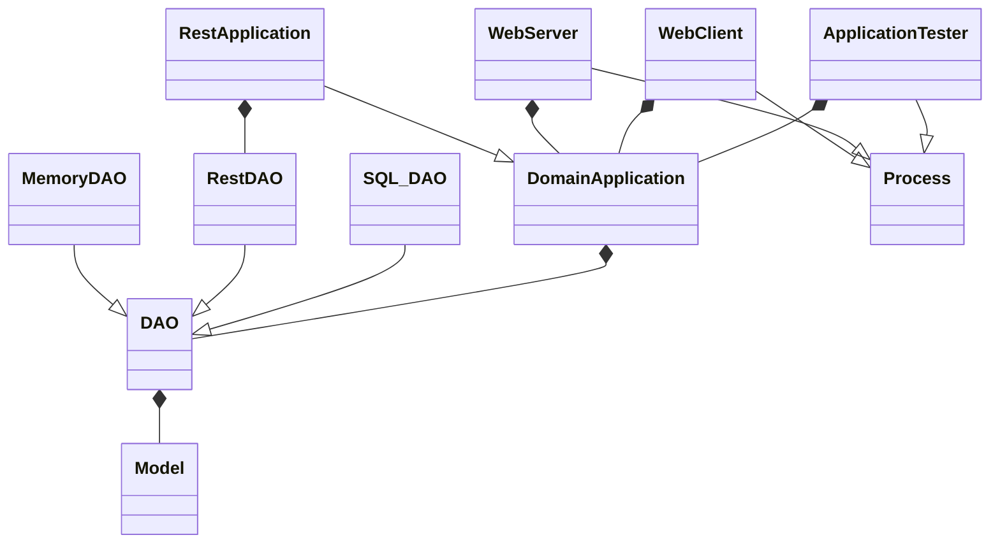
```mermaid
    classDiagram
        class DAO { }
            MemoryDAO --|> DAO
            RestDAO  --|> DAO
            SQL_DAO --|> DAO
            DAO *-- Model
            DomainApplication *-- DAO

        RestApplication --|> DomainApplication

        RestApplication *-- RestDAO

        WebServer *-- DomainApplication

        WebClient *-- DomainApplication
        ApplicationTester *-- DomainApplication

        WebClient --|> Process
        WebServer --|> Process
        ApplicationTester --|> Process

```

## UI Design

### UI Components
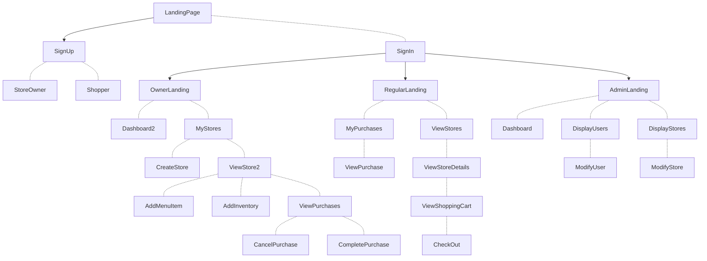
```mermaid
    graph TB
        LandingPage -->  SignUp -.- StoreOwner & Shopper
        
        LandingPage -.- SignIn --> OwnerLanding & RegularLanding & AdminLanding
            
            RegularLanding -.- MyPurchases -.- ViewPurchase
            RegularLanding -.- ViewStores -.- ViewStoreDetails -.- ViewShoppingCart -.- CheckOut
            
            OwnerLanding -.- Dashboard2
            OwnerLanding -.- MyStores -.- CreateStore & ViewStore2
                ViewStore2 -.- AddMenuItem & AddInventory & ViewPurchases
                    ViewPurchases -.- CancelPurchase & CompletePurchase

            AdminLanding -.- Dashboard & DisplayUsers & DisplayStores
                DisplayUsers -.- ModifyUser
                DisplayStores -.- ModifyStore

```

## Physical Design
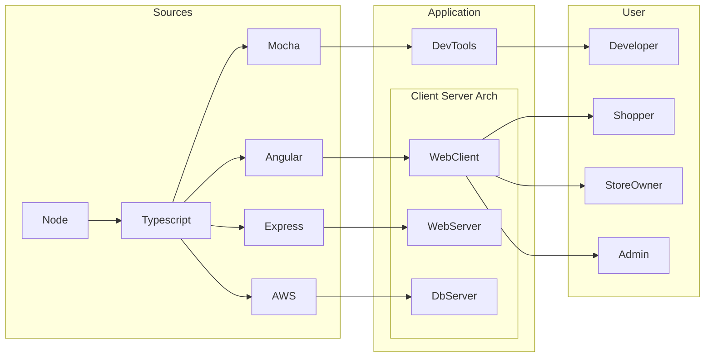
```mermaid
graph LR

    subgraph Sources
        Node --> Typescript --> Express & Angular & Mocha & AWS
    end
    
    subgraph User
        Developer & Shopper & StoreOwner & Admin
    end

    subgraph Application
        WebClient & WebServer 
        DevTools
        subgraph Client Server Arch
            WebClient & WebServer & DbServer
        end
    end
    
    Express --> WebServer
    Angular --> WebClient
    Mocha --> DevTools
    AWS --> DbServer
    
    DevTools --> Developer
    WebClient --> Shopper & StoreOwner & Admin
```

# DevOps

## Directory Structure
- business-model
- frontend-angular
- backend-server
    - backend-client
- abstract
    - common
    - dao
        - sqlite
        - cloud:*

## Development Processes
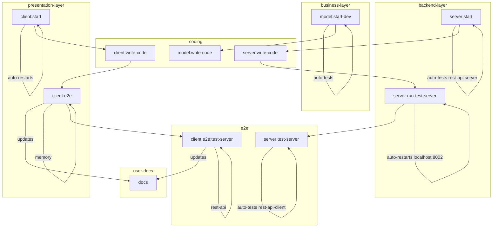
```mermaid
graph TD
    subgraph user-docs
        docs
    end

    client:e2e & client:e2e:test-server -->|updates| docs

    subgraph e2e
        client:e2e:test-server & server:test-server
    end

    subgraph coding
        client:write-code
        model:write-code
        server:write-code
    end

    subgraph business-layer
        model:start-dev -->|auto-tests| model:start-dev --> model:write-code
    end
    
    subgraph backend-layer
        server:start -->|auto-tests rest-api server | server:start
        server:start -->server:write-code --> server:run-test-server --> server:test-server
        server:run-test-server -->|auto-restarts localhost:8002| server:run-test-server
        server:test-server -->|auto-tests rest-api-client| server:test-server
    end
    
    subgraph presentation-layer
        client:start -->|auto-restarts| client:start
        client:e2e -->|memory| client:e2e
        client:e2e:test-server -->|rest-api| client:e2e:test-server
        client:start --> client:write-code --> client:e2e -->client:e2e:test-server
    end
    
```

## Questions for Buyer
- Would you like to have graphic design work done? Do you have a logo or colour scheme?
- Where does the shopper and their purchases go when the user is deleted?

## Standard Features Added
- Model validations
- Security
- Further error handling in the UI
    - Present backend errors
    - Present backend delays
    - Present model invalidations

## Suggested Improvements
- Frontend
    - Email verification
    - Reset password
- Dev Process
    - Linting in the development processes
    - Semantic Release in the CI : Update the changelog automatically
- Backend
    - Choosing a hosting provider
        - IE: AWS w/ RDBMS|DynamoDB|S3
        - IE: Azure w/ CosmosDB
        - IE: Docker with Express/Mongo
        - IE: Server Host with Mysql
    - repository for npm packages
    - repository for build artifacts

## TODO
- Consult with buyer to negotiate further milestones and agile iterations

# Edge Case Tests
- admin cannot delete self account
- admin edit user with no name
- sign up with bad email
- sign up with no password
- non admins can not delete or edit users, stores, purchases
- create store with no name
- send an expired token
- server is down
- server responds slowly

# sections that go into a README
- The scope and functionality.
- Directory structure.
- Instructions to get it up and running.
- The solution approach, and a brief story about it.
- Difficulties you encountered and how you tackle them.
- Performance and space requirements of the solution.
- List of dependencies
- List of supported browsers/platforms.
- Next steps to improve the solution.

# User Documentation
- visual walk-through of all the features, and their steps

## Landing Page
### As a user not logged in, they need to see the landing page with high-level details about the project (name,description)

	

Open the website - We are not logged in, and are given the login form

## Sign-Up
### Starting from the "Landing" page, click on the "Sign Up" menu link

	

From the landing page, click on the sign up button

## Sign Up as a Shopper
### As a user not logged in, there shall be functionality to sign up as a Shopper

	

Starting from the "Sign Up" page, fill in your email,

	

...your name,

	

...and password.
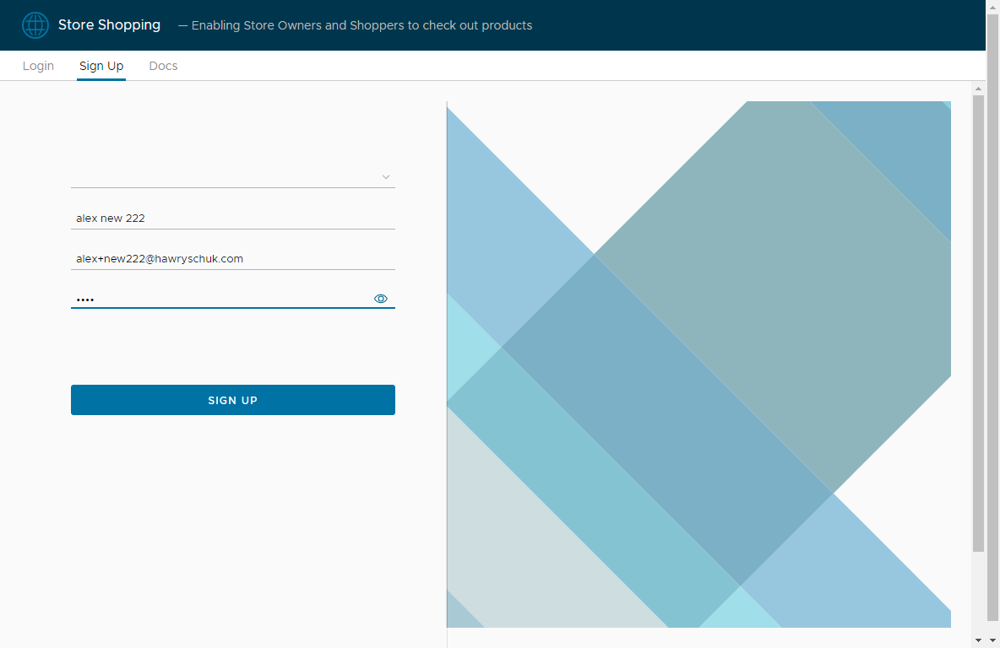

	

To finish, clicking on "Sign Up" will have you signed up, and signed in.

## Log In as a Shopper
### 

	

Starting from the "Log In" page, fill in your email address....

	

...your password,

	

...and after clicking on the "Login" button, you will be logged into the home page

## View Stores
### As a signed in regular user, I will see the list of stores

	

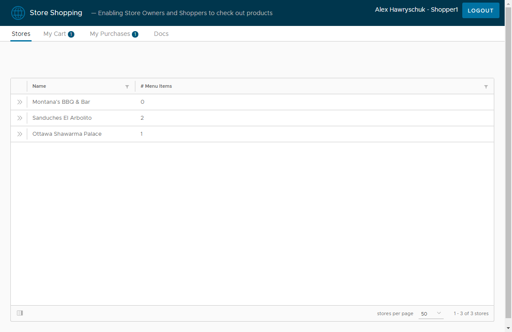

## View Store Details
### The "Store Details" includes the name, number of menu items, and a list of menu-items

	

Starting from the "stores" page,

	

...click on the row of the store and to view the "store details" (the menu items)
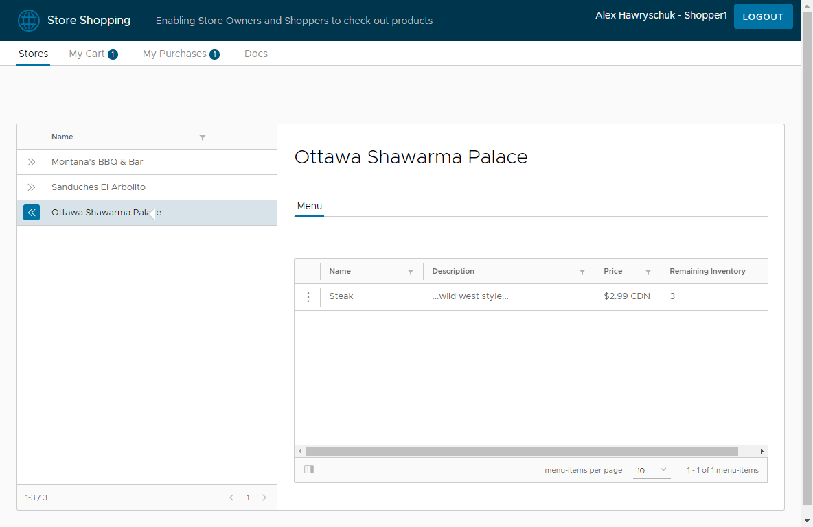

	

Note: When a store has no menu items, you may see the indication

## Add A Store
### As a Store Owner, I am able to manage the list of stores I have, and can add another store

	

Having signed in, and seeing the list of "My Stores",

	

...click on "Add Store"
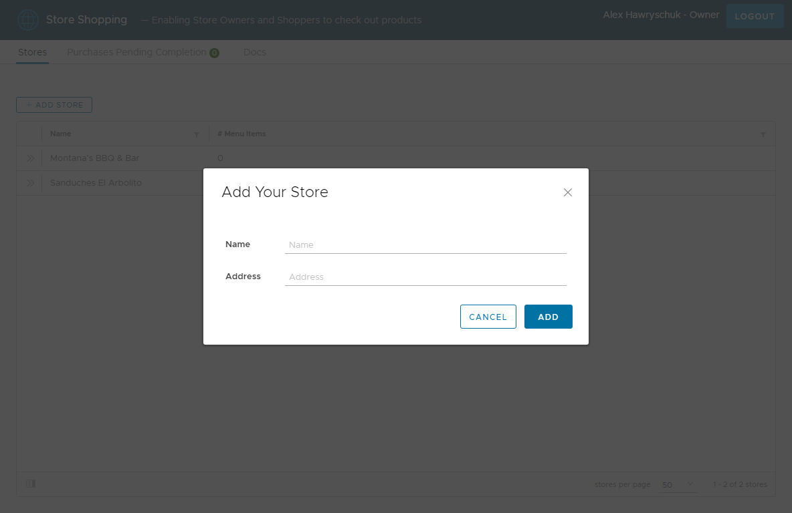

	

...and then fill in the name,
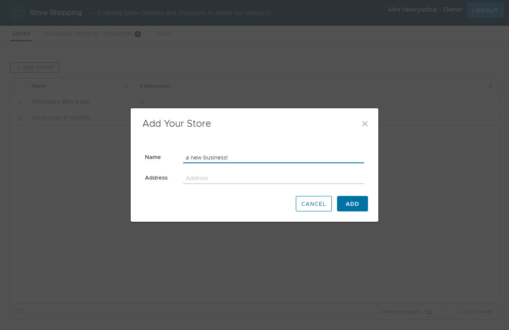

	

...and then the address,
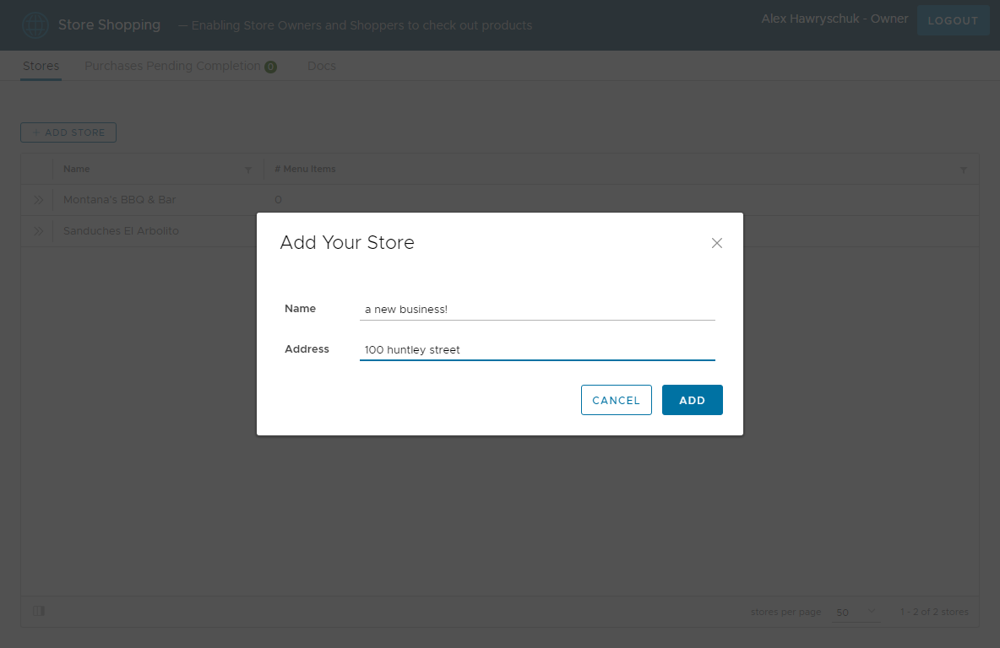

	

...and finish by clicking on "Save"
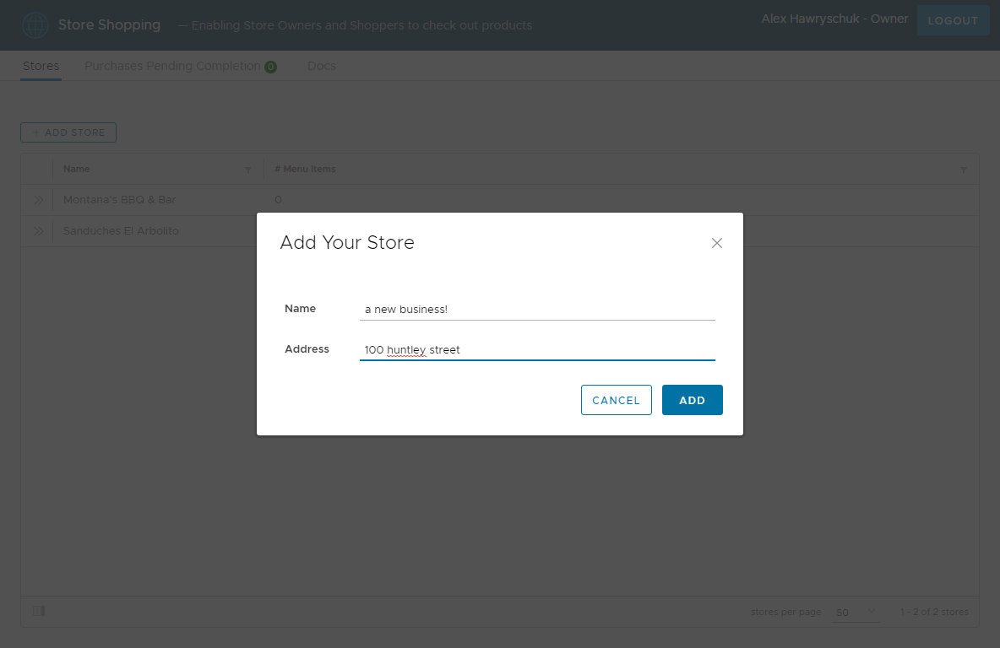

## Add A New Menu Item
### As a Store Owner, I am able to manage the list of menu items for each store (crud:name,price)

	

Having signed in, and seeing the list of "My Stores",

	

...click on the "Add Menu Item" button,

	

...fill in the name,

	

...the price,
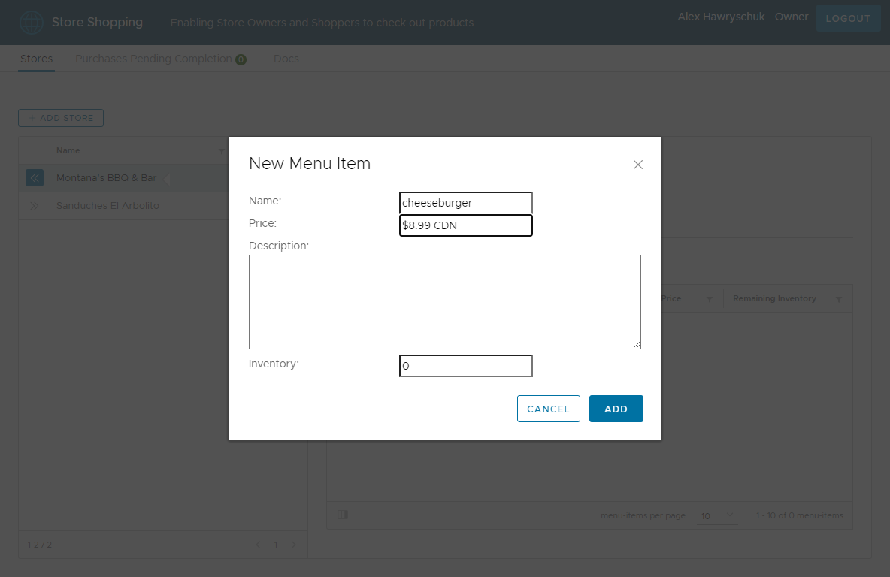

	

...the description,
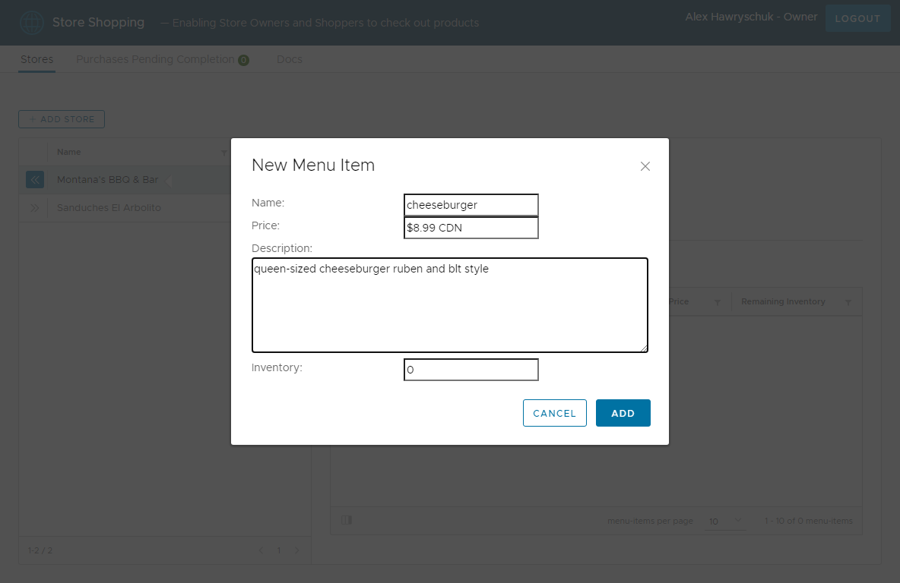

	

...the amount of inventory (optional),

	

...and finally finish by clicking on the "Add" button
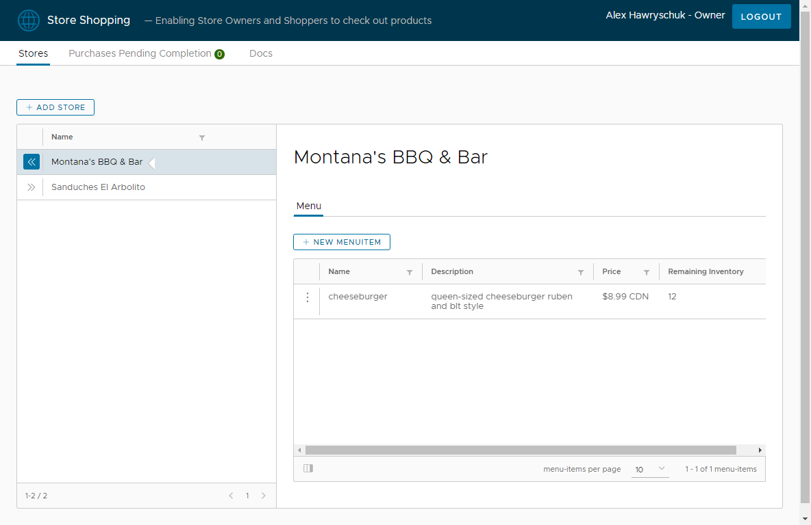

## Delete a Menu Item
### As a Store Owner, I can delete menu items

	

Having signed in, and seeing the list of "My Stores", click on the menu item, 

	

...and then the "Delete Menu Item" button (from the dropdown that appeared).

## Edit a Menu Item / Replenish product inventory
### As a Store Owner, I can update the inventory/menuitem details

	

Having signed in, and seeing the list of "My Stores", click on the menu item, 

	

...and then the "Edit Menu Item" button (from the dropdown that appeared).

	

Update the description

	

And the new inventory adjustment

	

...and finish by clicking on the "Save" button

## View My Purchases
### As a shopper, I am interested in seeing the past purchases I've made, and the progress of my recent purchases.

## Error Detection: Add Items to Cart
### As a regular user, you can add store menu items to your shopping cart

	

Starting from the "Store Details View" screen, and attempting to add the second menu item ( with no inventory left ),
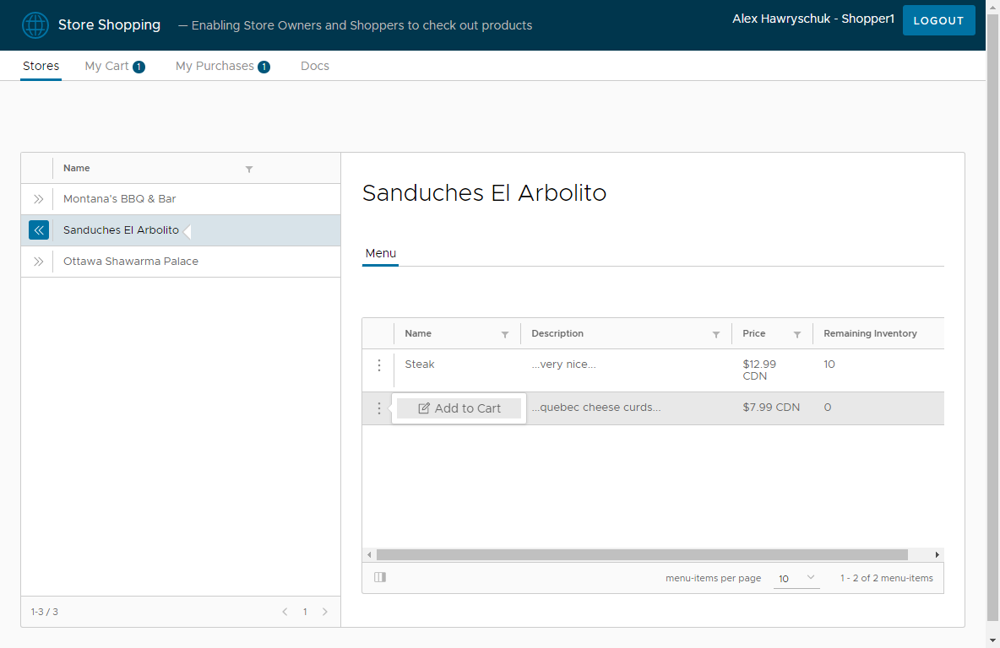

	

...having clicked on "Add to Cart" we will be alerted of the inability

## Add Items to Cart
### As a regular user, you can add store menu items to your shopping cart

	

Starting from the "Store Details View" screen,

	

...click on the dropdown button (ellipses symbol) on the left side of the user row,

	

...and then click on "Add To Cart". Your shopping cart now has one item.

## View My Cart
### As a regular user, having items in the cart, you may view the "My Cart" page to see the total cost and check out

	

Starting from the "Store Details View" screen,

	

You may view your shopping cart by clicking on the "My Cart" link,

	

...and you may checkout by clicking on the "Check Out" button

## Purchase items in "My Cart" (Checkout)
### As a regular user, having items in the cart, you may check-out the items and create a purchase

	

Starting from the "My Cart Page" screen,

	

...and you may checkout by clicking on the "Check Out" button

## Delete a User
### As an administrator user, I can delete users

	

Starting from the "Users" page,

	

...click on the dropdown button (ellipses symbol) on the left side of the user row,

	

...and finally click on the "Delete User" button to delete the user.
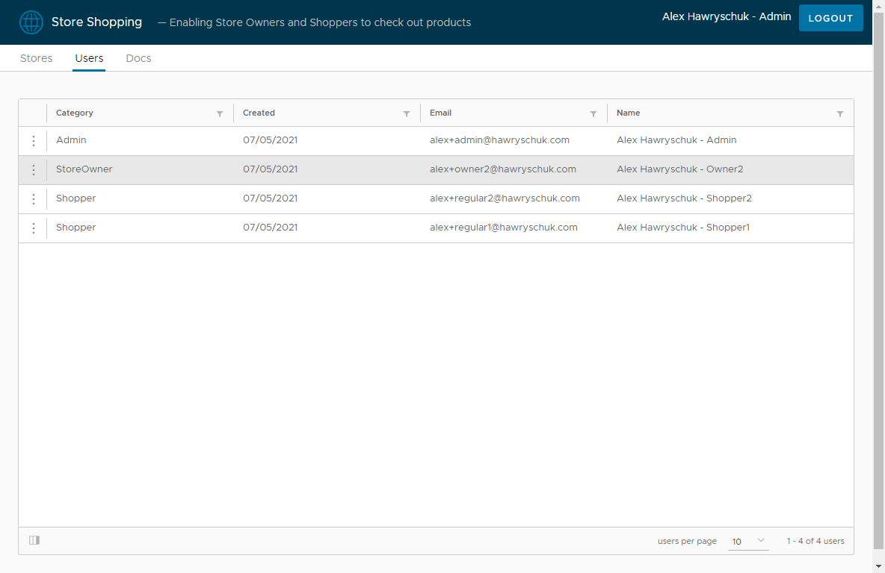

## Edit a User
### As an administrator user, I can edit users

	

Starting from the "Users" page,

	

...click on the dropdown button (ellipses symbol) on the left side of the user row,

	

...and then click on the "Edit User" button,

	

...and then proceed to enter in your changes,

	

...and finally, click on the "Save" button.

## Delete a Store
### As an administrator user, I can delete stores

	

Having signed in as an admin user, I can see a list of stores

	

Click on the "view" button for the store you wish to remove

	

Click on the "delete" button
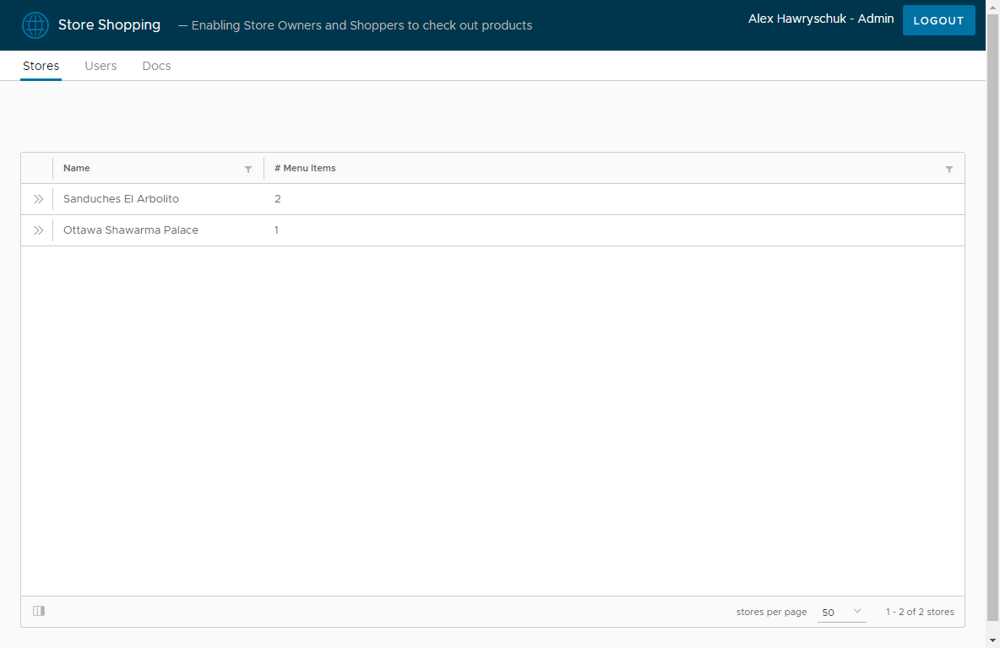

## Edit a Store
### As an administrator user, I can edit stores

	

Having signed in as an admin user, I can see a list of stores

	

Click on the "view" button for the store you wish to edit

	

Click on the "Edit Store" button
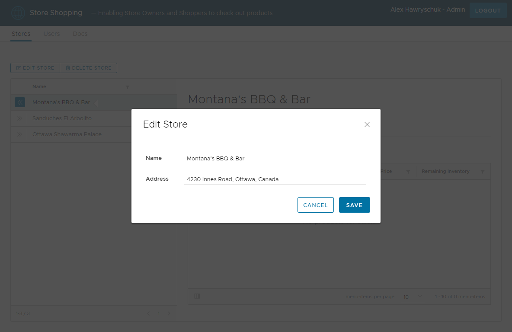

	

Make changes, such as typing a new name

	

Click on the save button
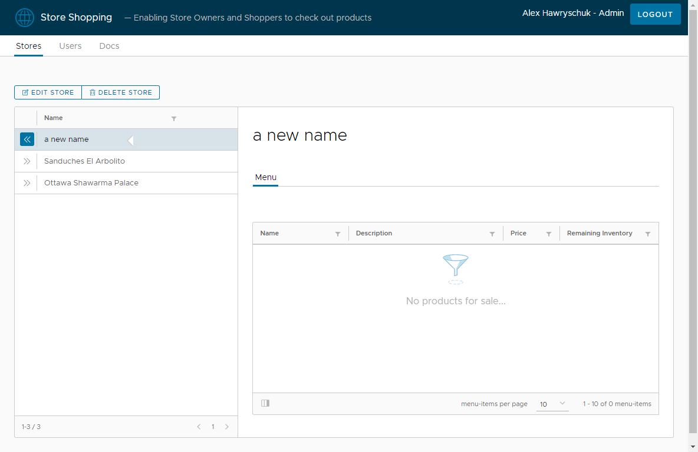

## Error Detection: Log In
### The username must exist, and the password must be correct

	

login-unknown-user

	

login-invalid-password
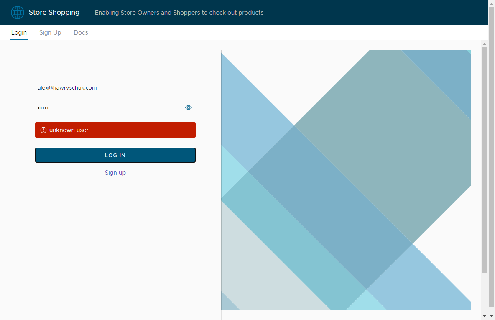

## Error Detection: Sign up
### The email must be valid, not already signed up, have a name, and a password.

	

signup-user-exists

	

signup-invalid-email

	

signup-invalid-name
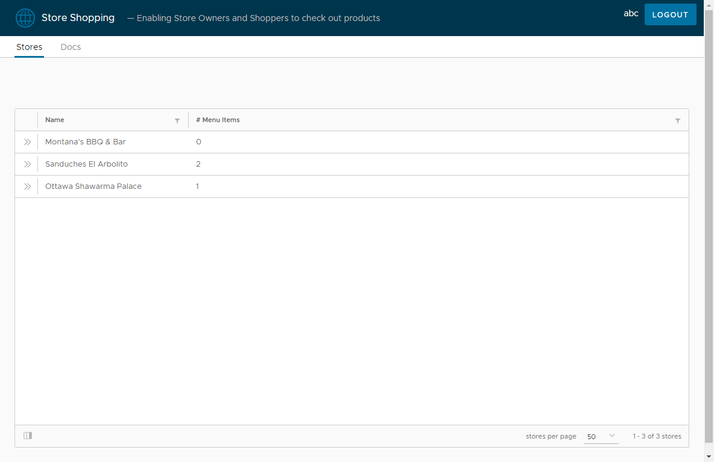

	

signup-invalid-password

## Error Detection: Create a store
### Stores must have a name

	

Starting from after clicking on the "Create Store" button,

	

Without filling in the store name, and submitting...
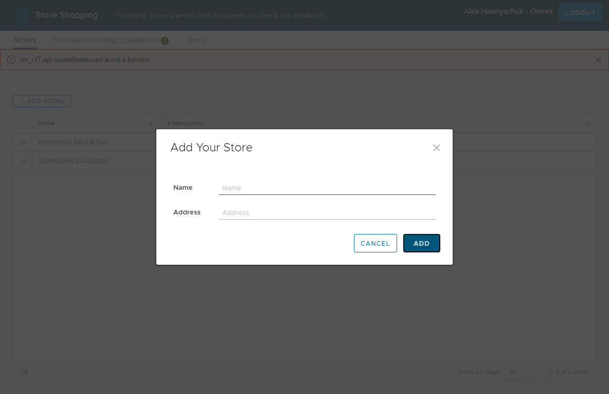

## Error Detection: Delete a User
### The administrator cannot delete his own user account

	

Starting from the "Users" page, try to delete your account...

## Error Detection: Edit a User
### A User must have a name

	

Starting from the "Users" page, having clicked opened the "Edit User" dialog,
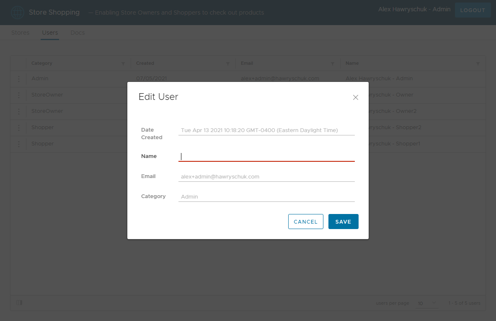

	

...and pressing save.
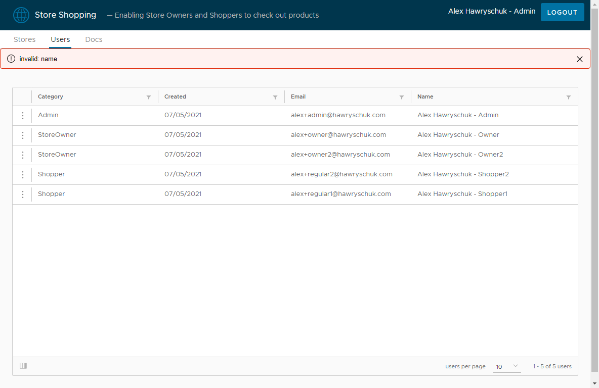

## Error Detection: Edit Store
### A store is required to have a name

	

Starting from the "Edit Store" dialog,
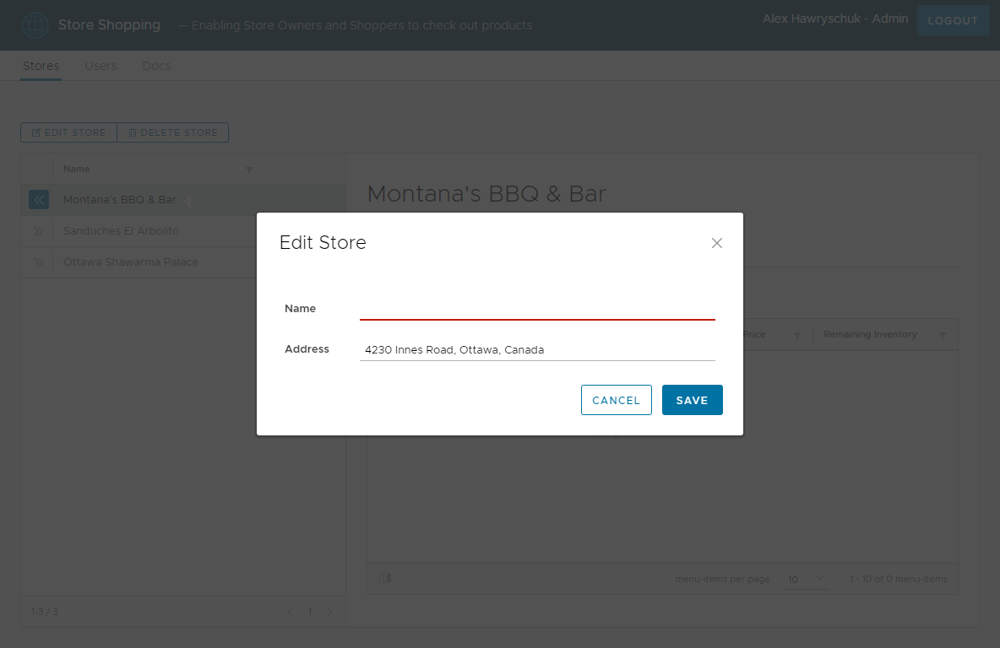

	

...once you click save, an alert will display.
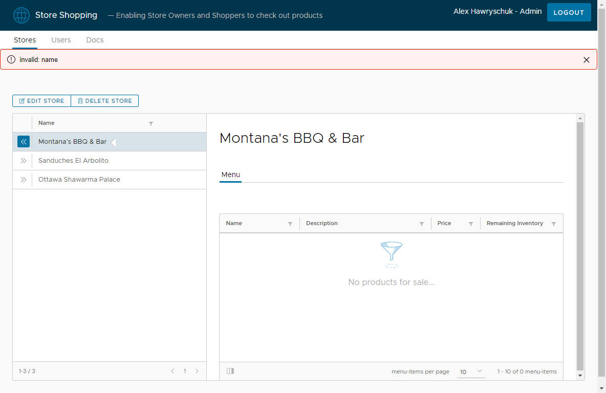

